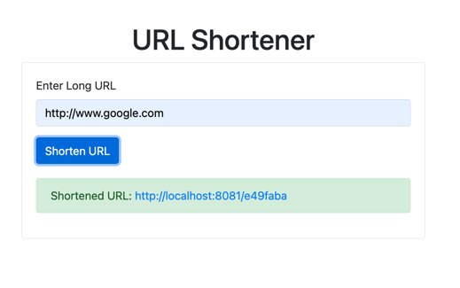

# UrlShortener
The UrlShortener app creates short aliases for long URLs. Users are redirected to the original URL when they visit the short link.


## System requirements
#### Functional
- The system should be able to generate short links for a given URL 
- If the system is given same URL, it should give the same short URL as it gave before instead of generating a new one.
- The system should be able to redirect to original URL when users visit short link
- The system should provide a metrics API that returns top 3 domain names

#### Non-functional
- URL and shortened URL should be stored in-memory by application.
- Flexible and Extensible
- Tests for functional code
- Option of deployment through Docker


## Tools and Tech Stack
- Java: JDK 17
- Framework: Spring Boot 3.2, Spring Web
- Build tool: Maven 3.6, Docker
- API docs: Swagger

## Installation
Clone git repo
```shell
git clone git@github.com:sourabh14/UrlShortener.git
```

Start the application:
```shell
cd UrlShortener
./mvnw spring-boot:run
```

### Installation through Docker
```shell
export JAVA_HOME="$(/usr/libexec/java_home -v 17)"
mvn clean package
docker build -t url-shortener:0.0.1 .
# Run app in background
docker run -d --name app-container -p 8081:8081 url-shortener:0.0.1
# Run integration tests
mvn test
```

## Usage

#### URL Shortener
Visit : http://localhost:8081/url/home.html



#### URL Redirectino
Visit the shortened URL to redirect to original URL

#### Top Domains
Visit: http://localhost:8081/api/v1/metrics/top-domains

## API Docs
Api docs generated via swagger are available at:
[http://localhost:8081/swagger-ui/index.html](http://localhost:8081/swagger-ui/index.html)

